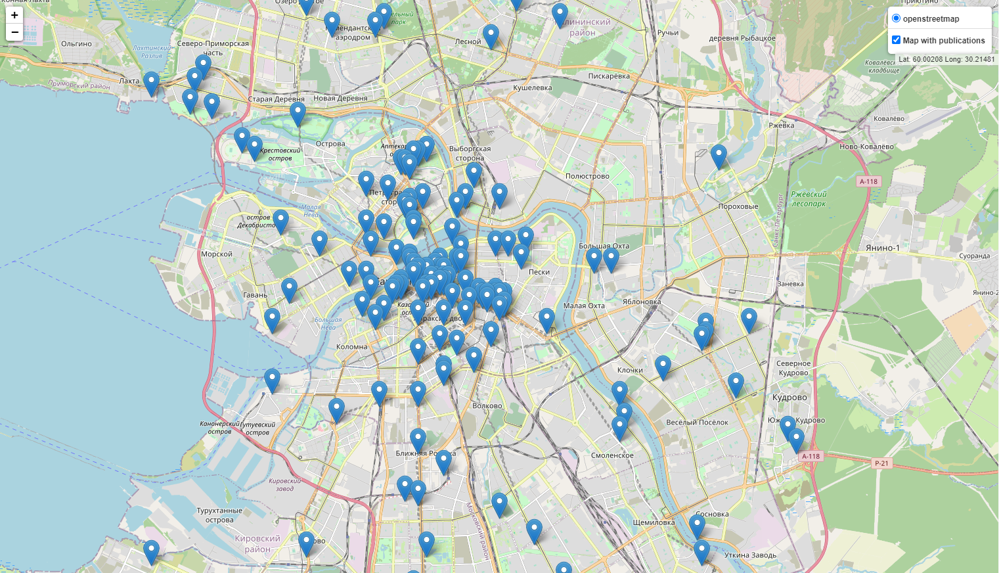

# IndustrialML


[IML](github.com/zer0deck/IndustrialML/) is a repo for ML Industry ITMO 2022 course.

## About

This repo contains two projects:

1. [Lab_1](https://github.com/zer0deck/IndustrialML/tree/main/Lab_1)



2. [Lab_2](https://github.com/zer0deck/IndustrialML/tree/main/Lab_2)

[](https://github.com/zer0deck/IndustrialML/releases)

## Table of content

- [IndustrialML](#industrialml)
  - [About](#about)
  - [Table of content](#table-of-content)
  - [Used libs](#used-libs)
  - [Using](#using)
  - [Requirements](#requirements)
  - [Authors](#authors)
  - [License](#license)

## Used libs

       

## Using

sdfg

## Requirements

 

Required python version is >=3.10. We recommend to use 3.11 version with conda.

```bash
conda install python=3.11
```

All requirements is located in file [requirements.txt](https://github.com/zer0deck/IndustrialML/blob/main/requirements.txt). You can install them via command down below:

```bash
pip install -r requirements.txt
```

## Authors

2022,
Grandilevskii Aleksei, software engineer,
github: [@zer0deck](https://github.com/zer0deck),
email: zer0deck.work@icloud.com,
website: zer0deck.com

2022,
Sorokin Mikhail, ML engineer,
github: [@Mikha1lSorokin](https://github.com/Mikha1lSorokin),
email: 338347@niuitmo.ru

2022,
Dubinin Ivan, ML engineer,
github: [@vandosik](https://github.com/vandosik)
email: 335433@niuitmo.ru 

## License

[](https://opensource.org/licenses/MIT)

Our project is licenced under default [MIT License](https://github.com/zer0deck/IndustrialML/blob/main/LICENSE).
